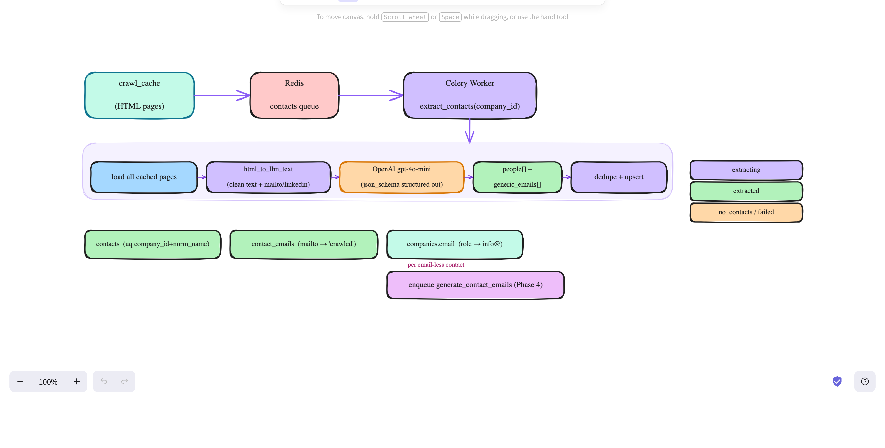

# Contact Extraction (Phase 3)

Reads a company's crawled HTML (`crawl_cache`) and uses an LLM to extract the
people who work there — name, title, seniority, LinkedIn — plus any emails visible
on the page, into `contacts` and `contact_emails`.



---

## Trigger

Phase 2 enqueues `extract_contacts(company_id)` for every company it successfully
crawls. To (re)run over already-crawled companies:

```bash
# crawled companies not yet extracted (default); reprocess=true re-runs all
curl -X POST localhost:8000/api/v1/contacts/trigger
```

---

## Why LLM extraction

Crawled team/about pages are heterogeneous (Tailwind `<div>` soup, no schema.org)
and per-person emails are mostly absent. Rule-based parsing has poor recall on this,
so extraction uses **OpenAI gpt-4o-mini** with strict `json_schema` structured
output. (OpenAI chosen over Claude Haiku: ~7× cheaper for this batched task at equal
quality.)

## Flow (per company)

```
load all cached pages → html_to_llm_text (clean text + mailto/linkedin links)
  → gpt-4o-mini (json_schema) → {people[], generic_emails[]}
  → dedupe + upsert
```

- **`html_to_llm_text`** (`app/services/contact_extract.py`) strips a page to visible
  text + a `LINKS:` appendix of `mailto:`/`linkedin` hrefs (which `get_text` would
  otherwise drop), capped at `contact_extract_max_chars_per_page` (12000). All of a
  company's pages (≤`contact_extract_max_pages`=8) go in **one batched call** so the
  model can dedupe people across pages in-context.
- **Structured output**: a single `record_contacts` schema returns
  `people:[{full_name, job_title, seniority, linkedin_url, email}]` + `generic_emails`.
  Validated with Pydantic before use.

## Writes (Postgres)

| Target | Rule |
|---|---|
| `contacts` | upsert on **`(company_id, normalized_name)`** with `COALESCE` (re-runs enrich, never blank). `normalize_person_name` does NOT strip surnames. |
| `contact_emails` | a person's `mailto:` email → `verification_source='crawled'`, `generation_confidence='high'`, dedup on `(contact_id, email)`. |
| `companies.email` | a generic/role address (info@, sales@) → set if the company has none. |

## `contact_status` state machine (`companies`)

```
extracting → extracted (≥1 contact) | no_contacts | failed (LLM error past retries)
```

## Handoff

For each contact **without** a captured email, enqueue
`generate_contact_emails(contact_id)` (Phase 4). Determined by a DB re-check so
re-runs stay idempotent.

## Config (app/config.py)

`openai_api_key` (required — set in `.env`), `contact_extract_model="gpt-4o-mini"`,
`contact_extract_max_chars_per_page=12000`, `contact_extract_max_pages=8`.
Dependency: `openai` (added in requirements). Migration `004` added
`contacts.normalized_name` + unique `(company_id, normalized_name)` and
`contact_emails` unique `(contact_id, email)`.

## Cost

~20K input + ~1K output tokens/company; cached system prefix. ≈ <$0.01/company.

## Verify (curl + psql)

```bash
curl -X POST localhost:8000/api/v1/contacts/trigger
docker compose exec db psql -U leadgen -d leadgen -c \
  "SELECT contact_status, count(*) FROM companies GROUP BY 1;"
docker compose exec db psql -U leadgen -d leadgen -c \
  "SELECT full_name, job_title, seniority FROM contacts WHERE company_id=:id;"
```

### Reference run (49 crawled companies)
```
480 contacts from 32 companies (~15 each) · 99 real emails captured
17 companies → no_contacts (thin / JS-only pages)
0 duplicate (company_id, normalized_name) — idempotent re-runs
```

## Notes / limits
- Quality is data-dependent — sites that list staff in plain text extract well;
  JS-only or sparse pages yield few/no people (`no_contacts`).
- Real emails captured here are skipped by Phase 4 (which only generates for
  email-less contacts). See `docs/emails.md` (Phase 4) and `docs/verify.md` (Phase 5).
