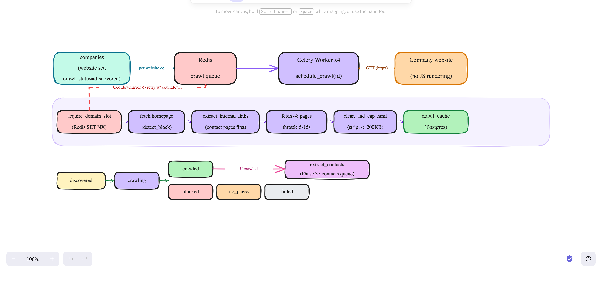

# Crawling System (Phase 2)

How LeadGen fetches each discovered company's website and caches the relevant
HTML pages, so Phase 3 (contact extraction) has content to parse.



---

## Trigger

Crawling is **not** a separate batch step — Phase 1 discovery enqueues it
**per company, inline**, the moment a company with a `website` is stored:

```python
# app/workers/discovery.py, inside _run_discovery
if normalized.get("website"):
    celery.send_task("app.workers.crawler.schedule_crawl",
                     args=[company_id], queue="crawl")
```

So the crawl `worker` consumes tasks *while discovery is still running* — the two
stages overlap, decoupled by the Redis `crawl` queue. No website → no crawl (the
company stays `discovered`).

---

## Flow

```
companies(website) → Redis crawl queue → Worker → fetch site (httpx)
   acquire_domain_slot → homepage → extract_internal_links (contact-first)
   → fetch ~8 pages (throttle 5–15s) → clean_and_cap_html → crawl_cache
   → crawl_status terminal → if crawled: enqueue extract_contacts (Phase 3)
```

### Locked decisions

- **httpx-only** — no JS rendering. JS-only shells yield nothing → `no_pages`.
- **Focused** — homepage + ~`crawl_target_pages` (8) contact-relevant pages;
  `crawl_max_pages_per_domain` (40) is only a hard guard.
- **No robots.txt** — public contact pages crawled directly.

---

## Reused infra (`app/services/reliability.py`)

- `acquire_domain_slot(domain, redis, min, max)` — per-domain politeness lock
  (Redis `SET NX` on `crawl:cooldown:{domain}`); raises `CooldownError` if busy.
- `detect_block(status_code, body)` — flags 403/429/503, empty 200s, or a
  **small** page containing a challenge phrase. Deliberately does **not** flag
  large content pages that merely reference `cloudflare`/`captcha` in an asset URL
  or form widget (that false positive was fixed — see below).

---

## Politeness

- `acquire_domain_slot` runs once at task entry; a domain already crawling raises
  `CooldownError` → the task **retries with a countdown** (not a failure),
  serializing same-domain crawls.
- `asyncio.sleep(crawl_delay_min..max)` between pages within a site.
- 4 worker processes, `prefetch=1` → only ~4 sites crawl at once. A full multi-page
  site takes 60–90s, so large runs are slow **by design**.

---

## `crawl_status` state machine (`companies`)

```
discovered → crawling → crawled | blocked | no_pages | failed
```

- `crawled` — ≥1 page stored; **only this** enqueues Phase 3.
- `blocked` — `detect_block` fired; domain abandoned.
- `no_pages` — no website, or JS-only shell with no usable HTML.
- `failed` — errored past `crawl_max_retries` (written by the sync wrapper).

---

## `crawl_cache` table — where HTML lives

One row per page (migration `003` added `company_id` + `content_type`):

| Column | Meaning |
|---|---|
| `url_hash` (PK) | sha256 of the normalized URL |
| `company_id` | which company the page belongs to (indexed) |
| `domain`, `url` | site + exact page URL |
| `raw_html` | **cleaned** HTML — scripts/styles stripped, capped at `crawl_html_max_bytes` |
| `content_type`, `status_code` | response metadata |
| `fetched_at`, `next_recrawl_at` | fetched time / eligible-to-refetch (= now + `recrawl_days`) |

**Idempotent:** before fetching, a page fresh within the recrawl window
(`next_recrawl_at > now()`) is served from cache — no network, no duplicate row.
Re-crawling a company within 45 days is a near-instant no-op.

---

## Config (app/config.py)

`crawl_user_agent`, `crawl_target_pages=8`, `crawl_max_pages_per_domain=40`,
`crawl_html_max_bytes=200000`, `crawl_delay_min/max_seconds=5/15`,
`recrawl_days=45`, `crawl_max_retries=2`.

---

## Verify

```bash
docker compose exec api alembic upgrade head      # applies migration 003
# trigger discovery for an active area → crawls auto-enqueue for website companies
docker compose exec db psql -U leadgen -d leadgen -c \
  "SELECT crawl_status, count(*) FROM companies GROUP BY 1;"
docker compose exec db psql -U leadgen -d leadgen -c \
  "SELECT company_id, url, status_code, length(raw_html) FROM crawl_cache LIMIT 10;"
```

### Reference run (1 area, Dubai Marina)

```
56 companies · 54 with website
  → crawled  49   (pages stored, ~6 pages each → 316 pages, ~24 MB)
  → blocked   4   (genuine 403 / challenge)
  → no_pages  1   (JS-only shell)
  → discovered 2  (no website — correctly never crawled)
91% of website-bearing companies crawled successfully.
```

`crawl_cache` only holds pages for the `crawled` companies — blocked / no_pages /
no-website companies have zero rows there, by design.

---

## Bug fixed during build — `detect_block` false positives

The original `detect_block` substring-matched `"cloudflare"`/`"captcha"` anywhere
in the body, so full 200 KB+ content pages (e.g. famproperties, Christie's) that
use a Cloudflare CDN or a reCAPTCHA form widget were wrongly marked `blocked`.
Fixed by only scanning **small** bodies (< 15 KB — real challenge pages are tiny
interstitials) and using block-specific phrases. Result: 6 false-positive blocks
→ 1 genuine block on the test area.

---

## Known gap / next

- **Stranded tasks:** if a crawl task is lost from the queue (crash, restart,
  broker hiccup), nothing currently re-enqueues it — the company stays
  `discovered`/`crawling`. The planned fix is a **reconciliation sweeper**: a
  Beat task that periodically re-enqueues companies stuck in a non-terminal
  status past a threshold. Cause-agnostic, self-healing.
- **JS-heavy sites** crawl thin under httpx-only; a Playwright render fallback is
  a later phase.
- See `docs/discovery.md` for Phase 1 and the shared zombie-task test hygiene note.
