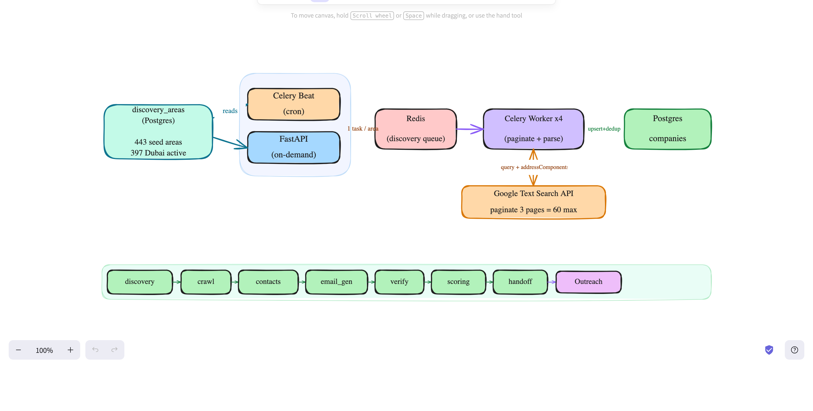

# Discovery System (Phase 1)

How LeadGen discovers real-estate companies via the Google Places **Text Search**
API, seeded from a curated list of areas.



---

## Flow

```
discovery_areas (Postgres)        curated seed areas, one row per area
        │  read active rows
        ▼
Producers                         Beat (cron) or FastAPI (on-demand)
        │  enqueue 1 task per area
        ▼
Redis (discovery queue)
        │
        ▼
Celery Worker ×4                  per area: paginate Text Search (≤3 pages = 60),
        │                         parse addressComponents, dedup, upsert
        ▼
Postgres (companies)              + run telemetry written back to discovery_areas
```

Each active area produces **one** `run_discovery` task. The worker pages through
Google Text Search (max 3 pages × 20 = **60 results/area**), maps each place to a
company, and upserts it with deduplication.

---

## The `discovery_areas` table

The seed list that drives discovery. Built **offline** (per location) and loaded
into the table; the running app only reads it.

| Column | Meaning |
|---|---|
| `area_name` | area/community queried, e.g. `Business Bay` |
| `emirate` | emirate the area belongs to |
| `source` | `seed` (curated CSV) or `loop` (legacy feedback discovery) |
| `is_active` | **on/off switch** — only active rows are queried |
| `last_run_at` | when this area was last queried (telemetry) |
| `last_result_count` | results returned on the last run (telemetry) |

### `is_active`

Controls whether an area is queried. Only `is_active = true` rows are fanned out
on the default (table-driven) trigger. Inactive rows stay in the table, ignored.

```sql
-- run only a few areas (testing / cost control)
UPDATE discovery_areas SET is_active = (area_name IN ('Dubai Marina','Deira'));

-- back to full Dubai run
UPDATE discovery_areas SET is_active = true WHERE emirate = 'Dubai';
```

> The `areas` override in the API request (see below) bypasses the table and
> `is_active` entirely — it queries exactly the names you pass.

---

## Ingesting the seed list

Everything needed is committed: migration `002`, `dubai_area_seeds.csv`, and the
loader. On any fresh system:

```bash
docker compose up -d

# 1. Create the schema (the table must exist before loading)
docker compose exec api alembic upgrade head

# 2. Load the CSV into discovery_areas
docker compose exec -e PYTHONPATH=/app api \
    python scripts/load_discovery_areas.py dubai_area_seeds.csv
```

- `PYTHONPATH=/app` is **required** (else `ModuleNotFoundError: No module named 'app'`).
- The loader is **idempotent** — upserts on `(emirate, area_name)`, safe to re-run.
- Rows route to the emirate in their `verified_emirate` column (cross-emirate
  rows load under their real emirate, not the file's nominal one).

### CSV format

The loader reads `area_name`, `verified_emirate` (falls back to `emirate`), and
`source`. For a new location, produce a CSV with at least those columns:

```csv
area_name,verified_emirate,source
Olaya,Riyadh,seed
Al Malqa,Riyadh,seed
```

```bash
docker compose exec -e PYTHONPATH=/app api \
    python scripts/load_discovery_areas.py riyadh_area_seeds.csv
```

The current `dubai_area_seeds.csv` holds 443 areas (397 Dubai + 46 cross-emirate
bonus seeds for Ajman/Sharjah/Abu Dhabi).

---

## Running discovery

### Table-driven (default) — queries active areas

```bash
curl -X POST localhost:8000/api/v1/discovery/trigger \
  -H "Content-Type: application/json" \
  -d '{"emirate":"Dubai","use_dld":false}'
```

### Ad-hoc — queries exactly the areas you pass (ignores the table)

```bash
curl -X POST localhost:8000/api/v1/discovery/trigger \
  -H "Content-Type: application/json" \
  -d '{"emirate":"Dubai","use_dld":false,"areas":["JLT","Business Bay"]}'
```

### Inspect results

```bash
docker compose exec db psql -U leadgen -d leadgen -c "SELECT count(*) FROM companies;"
curl "localhost:8000/api/v1/companies?emirate=Dubai&limit=10"
```

---

## Testing cleanly

A worker can hold an in-flight / retrying task that survives `purge` and even
worker restarts (`task_acks_late=True` redelivers unacked tasks). To guarantee a
clean baseline:

```bash
docker compose restart worker                          # kill in-flight zombies
docker compose exec worker celery -A celery_app purge -f
docker compose exec db psql -U leadgen -d leadgen -c "DELETE FROM companies;"
docker compose exec db psql -U leadgen -d leadgen -c \
  "UPDATE discovery_areas SET last_run_at=NULL, last_result_count=NULL;"
```

`purge` + `DELETE` alone is **not** enough — restart the worker too, or a stale
retry task will silently add rows to a later run.

### Reference numbers

3 active areas (Deira, Dubai Marina, Al Karama):
- raw: 3 × 60 = 180 (each hits the page cap)
- after dedup: **~157 unique companies** (~13% cross-area overlap merged)

---

## Deduplication

`upsert_company` runs a waterfall, first match wins:

1. `place_id` exact → upsert (Google records always have one)
2. `domain` exact → merge into existing row
3. `phone_e164` exact → merge into existing row
4. `normalized_name` trigram similarity > 0.7 → **flag only, insert as new row**

Step 4 deliberately does **not** auto-merge — e.g. *Ayana Properties* and *Ayana
holding* both normalize to `ayana` but are distinct companies (different domain,
phone, place_id), so they're kept separate and flagged for human review.

---

## Field extraction

`place_to_company_dict` maps a Text Search result to a company:

- `addressComponents` → `city`, `emirate`, `country` (English/romanized preferred;
  pure-Arabic components skipped)
- `internationalPhoneNumber` → `phone_e164` (validated via `phonenumbers`)
- `types` → `industry` (`real_estate_agency`, etc.)

Field fill is data-dependent: ~97% get a phone, ~80% a website, ~71% a city
(some Google records expose address components only in Arabic).

---

## Notes / limits

- **Page cap:** Text Search returns at most 60 results/area. An area with more
  agencies than that is under-covered — split it into finer area names in the CSV.
- **Beat:** no `beat_schedule` is defined yet; discovery is API-triggered only.
  Wiring a cron schedule that hits the trigger is the way to automate it.
- **Cost:** ~$0.032 per page request. A full 397-area Dubai run is roughly
  $13–20 depending on how many areas paginate to 3 pages.
