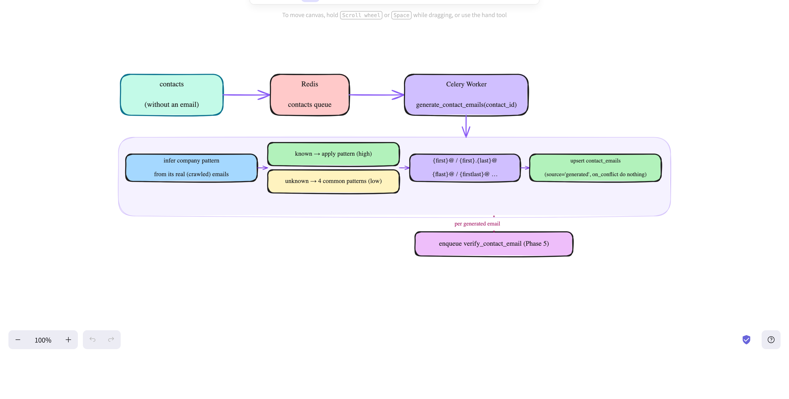

# Email Generation (Phase 4)

For contacts that have no real email, generates likely addresses from the person's
name + company domain — inferring the company's pattern from its real emails where
possible, falling back to common patterns otherwise.



---

## Trigger

Phase 3 enqueues `generate_contact_emails(contact_id)` for each contact without a
captured (crawled) email.

---

## Flow (per contact)

```
infer company pattern from its real (crawled) emails
   ├─ known   → apply that pattern        → confidence = high
   └─ unknown → 4 common patterns          → confidence = low
→ build emails ({first}@, {first}.{last}@, {flast}@, {firstlast}@ …)
→ upsert contact_emails (source='generated', on_conflict do nothing)
→ enqueue verify_contact_email (Phase 5) per new email
```

### Pattern inference (`app/services/email_patterns.py`)
- `infer_company_patterns(known)` matches each real email's local-part against the
  person's name to learn which convention the company uses (e.g. Luxfolio → `{first}@`,
  White & Co → `{first}.{last}@`), ranked by frequency.
- `generate(first, last, domain, patterns)` applies patterns → de-duplicated emails.
- `_slug` normalizes names (drops accents/punctuation: `O'Neill` → `oneill`).
- `DEFAULT_PATTERNS = [first, first.last, flast, firstlast]` is the fallback when the
  company has no real emails to learn from.

## Confidence
| case | confidence | # emails |
|---|---|---|
| company pattern inferred | `high` | top 1–2 inferred patterns |
| no real emails to learn from | `low` | 4 fallback candidates (Phase 5 verifies which is real) |

## Idempotency & guards
- Skips a contact that already has a **crawled** email (real beats generated).
- `on_conflict_do_nothing` on `(contact_id, email)` — re-runs add no duplicates.
- Requires `first_name` + company `domain`; otherwise no-op.

## No migration
`contact_emails` already had `pattern`, `generation_confidence`, `verification_source`.

## Verify (curl + psql)
```bash
docker compose exec db psql -U leadgen -d leadgen -c \
  "SELECT verification_source, generation_confidence, count(*)
   FROM contact_emails GROUP BY 1,2;"
```

### Reference run (over 481 contacts)
```
100% of contacts now have ≥1 candidate email:
  99   crawled  (real, from Phase 3)
  31   generated · high  (company pattern inferred — e.g. atomic.ae/IMEX → first@)
  1424 generated · low   (fallback, ~4 candidates each)
idempotent re-runs (0 duplicates)
```

## The tradeoff
The 1,424 low-confidence emails are **guesses** — multiple candidates per contact at
companies whose pattern couldn't be inferred. **Phase 5 (verification) is what
collapses them** to the deliverable address. See `docs/verify.md`.

## Notes
- Inference quality depends on having real emails for the company; companies with
  zero crawled emails get fallback only.
- Upstream: `docs/contacts.md` (Phase 3). Downstream: `docs/verify.md` (Phase 5).
