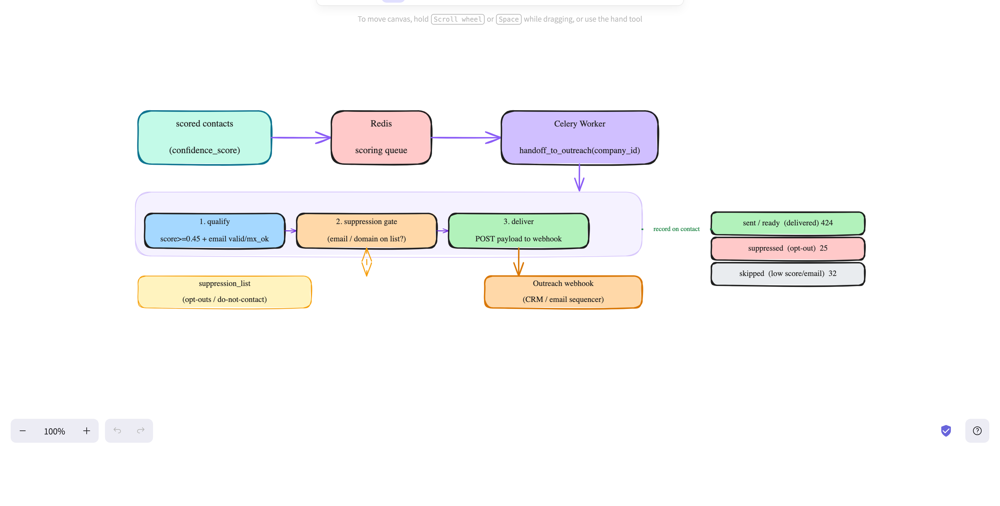

# Outreach Handoff (Phase 7)

The terminal step: takes scored leads, qualifies them, clears them against the
suppression list, and delivers them to the outreach system (CRM / email sequencer).
This pipeline produces leads — it does **not** send the actual emails; handoff is
the bridge to whatever does.



---

## Trigger

```bash
curl -X POST localhost:8000/api/v1/handoff/trigger
```

`handoff_to_outreach(company_id)` processes each of that company's contacts whose
`handoff_status='pending'`.

## The gate (per lead)

```
1. qualify    email ∈ {valid, mx_ok} AND score ≥ handoff_min_score (0.45)   else → skipped
2. suppress   email or its domain on suppression_list                        → suppressed
3. deliver    POST payload to outreach_webhook_url → sent / failed
              (no webhook configured → ready)
→ record handoff_status + handed_off_at on the contact
```

- **Suppression** reuses `app/services/suppression.py :: is_suppressed`, checking
  both the email and its domain against `suppression_list` (opt-outs,
  do-not-contact, competitors).
- **Delivery** (`app/integrations/outreach_handoff.py`): `build_payload` maps the
  lead to the wire format (company, name, title, email, score, tier); `deliver`
  POSTs it (httpx, 2xx = success).
- **Idempotent** — only `pending` contacts are processed, so re-runs don't
  re-deliver `sent` leads.

## `handoff_status` values

| status | meaning |
|---|---|
| `pending` | not yet processed (default) |
| `sent` | delivered to the outreach webhook |
| `ready` | qualified + cleared, but no webhook configured (would have sent) |
| `failed` | webhook POST errored |
| `suppressed` | email/domain on the suppression list |
| `skipped` | didn't qualify (low score, or email invalid/risky/missing) |

## Why handoff is its own phase

- **Compliance** — the suppression / opt-out check must run at send time; emailing a
  suppressed address is a legal + reputation problem.
- **Tracking / idempotency** — records what's been delivered so nobody is contacted twice.
- **Decoupling** — the outreach platform can change (Instantly → Smartlead) by
  changing only this phase + `outreach_webhook_url`.
- **Side-effects isolated** — it's the one outward-facing, data-pushing step.

## Config / migration

- `outreach_webhook_url` (set in `.env` to enable real delivery), `handoff_min_score=0.45`.
- Migration `006` adds `contacts.handoff_status` + `handed_off_at`.

## Verify
```bash
curl -X POST localhost:8000/api/v1/handoff/trigger
docker compose exec db psql -U leadgen -d leadgen -c \
  "SELECT handoff_status, count(*) FROM contacts GROUP BY 1;"
```

### Reference run (481 contacts, suppressed `atomic.ae` for the demo)
```
ready 424   (qualified + cleared — no webhook configured, so marked ready)
suppressed 25  (all atomic.ae — the suppression gate)
skipped 32  (18 no-email, 4 risky, 1 unknown, 9 below score threshold)
```
Exported to `exports/phase7_handoff_ready.{csv,txt}` — the prioritized,
suppression-cleared outreach list.

## What it does NOT do
Write/send the actual emails, run follow-up sequences, or handle replies — that's
the outreach platform's job. Handoff hands over a clean, scored, cleared lead and
records that it did.

## Notes
- Set `OUTREACH_WEBHOOK_URL` and the 424 `ready` leads become `sent`.
- Upstream: `scoring.md` (Phase 6). This is the final pipeline phase.
