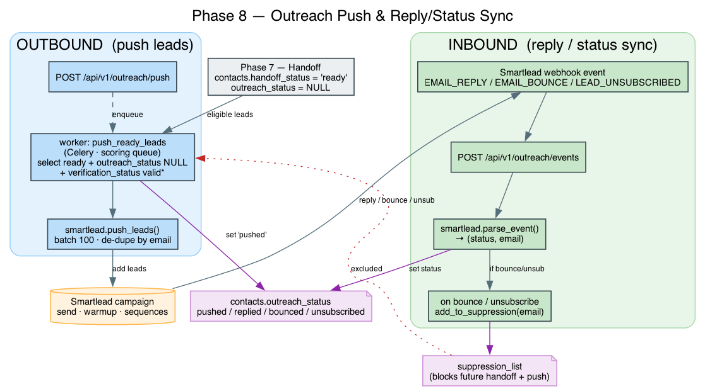

# Outreach Push & Reply/Status Sync (Phase 8)

Phase 7 produces clean, scored, suppression-cleared leads and marks them `ready`.
Phase 8 connects them to a real sender — **Smartlead** — and closes the loop:
it **pushes** ready leads into a campaign and **syncs** the outcomes
(reply / bounce / unsubscribe) back onto the contact. Smartlead owns the actual
sending, warmup, inbox rotation, and follow-up sequences; this phase is the
two-way bridge.



```
                        Phase 7
                 contacts.handoff_status='ready'
                            │
            ┌───────────────┴────────────────┐
            │  PUSH (outbound)                │
            │  push_ready_leads worker        │
            │  → smartlead.push_leads()       │
            │  → contacts.outreach_status     │
            │       = 'pushed'                │
            └───────────────┬─────────────────┘
                            │
                    Smartlead campaign
                 (send / warmup / sequences)
                            │
            ┌───────────────┴─────────────────┐
            │  SYNC (inbound webhook)          │
            │  POST /api/v1/outreach/events    │
            │  → smartlead.parse_event()       │
            │  → contacts.outreach_status      │
            │       = replied|bounced|unsub    │
            │  → suppression_list (bounce/unsub)│
            └──────────────────────────────────┘
```

---

## Push (outbound)

```bash
curl -X POST localhost:8000/api/v1/outreach/push
```

`push_ready_leads` (`app/workers/outreach.py`) selects leads where
`handoff_status='ready'` **and** `outreach_status IS NULL`, maps them to
Smartlead's schema, and POSTs them in batches of 100.

- **Deliverability gate** — `outreach_valid_only=true` (default) pushes only
  paid-confirmed `valid` emails; set it false to also include `mx_ok`. Protecting
  sender reputation is why this is stricter than the Phase 7 qualify gate.
- **Idempotent** — only `NULL` `outreach_status` rows are eligible, and Smartlead
  de-dupes by email within a campaign, so re-runs don't double-add.
- **No-op when unconfigured** — without `smartlead_api_key` + `smartlead_campaign_id`
  the worker logs and returns; nothing is pushed.

On success the pushed contacts are marked `outreach_status='pushed'`.

## Reply / status sync (inbound)

Configure this URL as the webhook in your Smartlead campaign settings:

```
POST https://<host>/api/v1/outreach/events
```

`outreach_events` (`app/api/companies.py`) hands the raw payload to
`smartlead.parse_event()`, which maps the event and lead email defensively
(Smartlead's field names vary across versions):

```
event contains "reply"  → replied
event contains "bounce" → bounced
event contains "unsub"  → unsubscribed
anything else           → ignored (200, no-op)
```

It then:

1. **Updates the contact** — matches `contact_emails.email` **case-insensitively**
   and sets `outreach_status` on *every* contact carrying that address (a shared
   role email can map to more than one).
2. **Suppresses on bounce/unsubscribe** — adds the email to `suppression_list`
   with reason `outreach:bounced` / `outreach:unsubscribed`, so the same address
   is never handed off or pushed again (the Phase 7 gate + Phase 8 push both honor
   it). Replies are recorded but **not** suppressed.

The endpoint always returns `200` (even for unmapped events) so Smartlead's
webhook delivery doesn't retry on payloads we intentionally ignore.

## `outreach_status` values

| status | set by | meaning |
|---|---|---|
| `NULL` | default | not yet pushed |
| `pushed` | push worker | added to the Smartlead campaign |
| `replied` | inbound webhook | lead replied (success signal) |
| `bounced` | inbound webhook | hard/soft bounce → also suppressed |
| `unsubscribed` | inbound webhook | opt-out → also suppressed |

## Why push and sync are one phase

- **Closes the loop** — Phase 7 ends at "would send"; Phase 8 actually sends
  (via Smartlead) and feeds the result back so the data model knows what happened.
- **Compliance** — bounces and opt-outs become suppression entries at the moment
  they're reported, so they're enforced on every future run.
- **Decoupled sender** — swapping Smartlead for another platform changes only
  `app/integrations/smartlead.py` + the `smartlead_*` config; the worker, webhook
  endpoint, and schema stay put.

## Config (app/config.py)

| key | default | purpose |
|---|---|---|
| `smartlead_api_key` | `""` | Smartlead API key (auth via `?api_key=`) |
| `smartlead_campaign_id` | `""` | target campaign for pushed leads |
| `smartlead_base_url` | `https://server.smartlead.ai/api/v1` | API base |
| `outreach_valid_only` | `true` | push only paid-`valid` emails |

## Migration

`007_contact_outreach` — adds `contacts.outreach_status` (text) + index
`ix_contacts_outreach_status`.

## Verify

```bash
docker compose exec api alembic upgrade head        # applies 007

# push ready leads (no-op without smartlead_* configured)
curl -X POST localhost:8000/api/v1/outreach/push

# simulate an inbound reply event
curl -X POST localhost:8000/api/v1/outreach/events \
  -H 'Content-Type: application/json' \
  -d '{"event_type":"EMAIL_REPLY","to_email":"someone@example.ae"}'

docker compose exec db psql -U leadgen -d leadgen -c \
  "SELECT outreach_status, count(*) FROM contacts GROUP BY 1;"
# bounce/unsub also land here:
docker compose exec db psql -U leadgen -d leadgen -c \
  "SELECT * FROM suppression_list WHERE reason LIKE 'outreach:%';"
```

## What it does NOT do

Write copy, configure sequences, manage warmup/inbox rotation, or classify reply
sentiment — that's Smartlead's job. Phase 8 pushes the lead and records the
machine-readable outcome.

## Notes

- Upstream: `handoff.md` (Phase 7). This phase consumes only `ready` leads, so a
  Phase 7 webhook (`outreach_webhook_url`) and Smartlead are mutually exclusive
  delivery paths — leave `OUTREACH_WEBHOOK_URL` unset to let Smartlead deliver.
- The inbound webhook is unauthenticated; front it with a network ACL or add a
  shared-secret check if exposed publicly.
