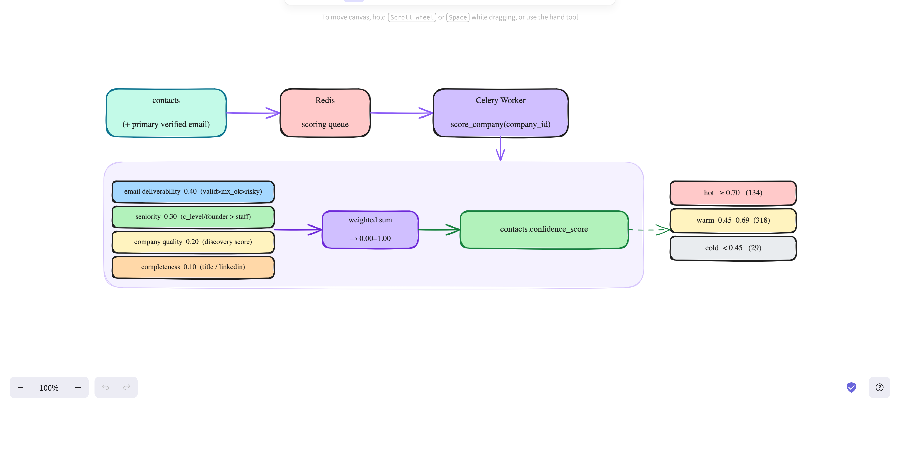

# Lead Scoring (Phase 6)

Turns each contact + its primary (verified) email + company quality into a single
0–1 **lead score** for outreach prioritization. Verification answers *"can we reach
them"*; scoring answers *"is it worth it, and who first"*.



---

## Trigger

```bash
# score every company that has extracted contacts
curl -X POST localhost:8000/api/v1/scoring/trigger
```

`score_company(company_id)` scores all of that company's contacts and writes
`contacts.confidence_score`.

## The score (`app/services/scoring.py :: score_lead`)

A weighted sum of four signals (weights sum to 1.0):

| Signal | Weight | Notes |
|---|---|---|
| **email deliverability** | 0.40 | `valid` 1.0 · `mx_ok` 0.55 · `risky` 0.25 · `unknown` 0.15 · `invalid` 0. **+0.15** if the email was `crawled` (real); **×0.7** if it's a role inbox |
| **seniority** | 0.30 | `c_level`/`founder` 1.0 · `director` 0.8 · `manager` 0.6 · `senior` 0.45 · `staff` 0.30 · `unknown` 0.15 |
| **company quality** | 0.20 | the company's discovery `confidence_score` |
| **completeness** | 0.10 | has job_title (0.5) + has linkedin (0.5) |

Result is capped at 1.00 and stored in `contacts.confidence_score`.

## Tiers (`tier()`)

```
hot   ≥ 0.70
warm  0.45 – 0.69
cold  < 0.45
```

## Why scoring exists (vs. emailing every valid address)

- **Sender reputation** — blasting `risky`/`mx_ok`/unconfirmed addresses causes
  bounces that wreck deliverability of *all* future sends. Scoring gates outreach
  to high-confidence leads.
- **Prioritization** — finite outreach capacity; contact the best decision-makers
  first, not everyone.
- **Targeting** — a verified email for a junior agent is worth less than the Sales
  Director; seniority is weighted heavily.

## No migration
Uses the existing `contacts.confidence_score` (Numeric(3,2)).

## Verify
```bash
curl -X POST localhost:8000/api/v1/scoring/trigger
docker compose exec db psql -U leadgen -d leadgen -c \
  "SELECT CASE WHEN confidence_score>=0.70 THEN 'hot'
               WHEN confidence_score>=0.45 THEN 'warm' ELSE 'cold' END AS tier,
          count(*) FROM contacts GROUP BY 1;"
```

### Reference run (481 contacts)
```
hot  134   warm 318   cold 29   (avg 0.62, range 0.30–0.95)
```
Top leads are founders / C-levels with paid-`valid` emails (e.g. Sam McCone 0.95,
Neil MacLean 0.95). Exported to `exports/phase6_lead_scores.{csv,txt}`.

## Notes
- Upstream: `verify.md` (Phase 5). Downstream: `handoff.md` (Phase 7) consumes the
  score to decide which leads clear the qualification threshold (`handoff_min_score`).
