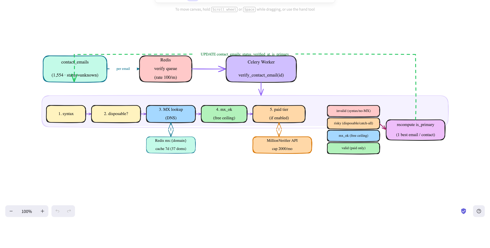

# Email Verification (Phase 5)

Verifies the deliverability of the emails in `contact_emails` (real + generated)
and flags one **primary** email per contact for outreach.



---

## Trigger

Phase 4 enqueues `verify_contact_email(email_id)` for each email it generates. To
(re)run over existing rows there's also an endpoint:

```bash
# verify all 'unknown' emails (default); reprocess=true re-verifies everything
curl -X POST localhost:8000/api/v1/verify/trigger
```

The `verify` task carries `rate_limit="100/m"` — a deliberate throttle (protects the
paid API + DNS), so large runs are paced at ~100/min.

---

## The verification ladder (free tier — stops at first verdict)

`app/services/email_verify.py :: verify_email()`:

```
1. syntax       valid format?            no  → invalid
2. disposable   throwaway domain?        yes → risky
3. MX lookup    domain accepts mail?     no  → invalid     (kills dead-domain guesses)
4. (MX present) → mx_ok                                     (free ceiling)
5. paid tier    if enabled + under cap   → valid / invalid / risky
```

- **MX lookup is per-domain and Redis-cached** (`mx:{domain}`, 7d, positive *and*
  negative). The 1,554 emails span only ~37 domains, so DNS runs ~37 times; the rest
  are cache hits. This is the single biggest throughput win.
- **No raw SMTP probing** — port 25 is typically blocked from a container host and
  SMTP checks are unreliable (catch-all, greylisting, blacklist risk).

## `verification_status` values

| status | set by | meaning |
|---|---|---|
| `invalid` | free (bad syntax / no MX) or paid (`invalid`) | undeliverable |
| `risky` | free (disposable) or paid (`catch_all`/`disposable`) | accept-all / low-trust |
| `mx_ok` | free ceiling | syntax + domain MX pass, mailbox unconfirmed |
| `valid` | paid only (`ok`) | confirmed deliverable |
| `unknown` | initial / transient error | unprocessed |

Phase 5 writes `verification_status`, `verified_at`, `is_role_email`, and
`is_primary`. It does **not** touch `verification_source` — that stays the email's
*origin* (`crawled` / `generated`).

> **Free-tier ceiling:** without the paid tier, a live-domain guess can only reach
> `mx_ok` — we know the domain accepts mail, not which mailbox is real. Turning
> `mx_ok` into a confirmed `valid` for an individual address requires the paid tier.

---

## Paid tier (MillionVerifier) — gated, off by default

Runs only when `paid_verify_enabled=true`, a `millionverifier_api_key` is set, and
the monthly cap isn't reached. For each `mx_ok` address it calls MillionVerifier v3
and maps the result:

```
ok → valid    catch_all → risky    disposable → risky    invalid → invalid    unknown → unknown
```

- **Monthly cap:** Redis counter `verify:paid:usage:{YYYYMM}` (INCR after a
  successful call, 35d expiry). At `paid_verify_monthly_cap` (default 2000) it stops
  calling and leaves addresses at `mx_ok`.
- **Fail-safe:** any API error/timeout → leave `mx_ok`, never fail the task.

Enable it:
```
# .env
ANTHROPIC... (n/a)
MILLIONVERIFIER_API_KEY=...
PAID_VERIFY_ENABLED=true
```

---

## Primary email per contact

After each email verifies, `_recompute_primary(contact_id)` ranks the contact's
candidates and flags exactly one `is_primary`:

```
rank = (status: valid > mx_ok > risky > unknown > invalid,
        personal > role,
        crawled > generated,
        high-confidence > low-confidence,
        lowest email_id)
```

- `SELECT ... FOR UPDATE` locks the contact's rows so concurrent per-email verifies
  don't race. The ranking is deterministic, so the last writer converges to the
  correct winner regardless of order.
- If **all** of a contact's candidates are `invalid`, no primary is set (we won't
  designate a known-dead address).

The clean lead email for a contact is then:
```sql
SELECT email FROM contact_emails WHERE contact_id = :id AND is_primary;
```

---

## Config (app/config.py)

`paid_verify_enabled=False`, `millionverifier_api_key`, `paid_verify_monthly_cap=2000`,
`paid_verify_provider="millionverifier"`, `mx_cache_ttl_days=7`. No new dependencies
(`dnspython`, `httpx`, `redis.asyncio` already present).

## Migration

`005_contact_email_primary` — adds `contact_emails.is_primary` (bool) + index
`(contact_id, is_primary)`.

## Verify (curl + psql)

```bash
docker compose exec api alembic upgrade head        # applies 005
curl -X POST localhost:8000/api/v1/verify/trigger
docker compose exec db psql -U leadgen -d leadgen -c \
  "SELECT verification_status, count(*) FROM contact_emails GROUP BY 1;"
# exactly <=1 primary per contact:
docker compose exec db psql -U leadgen -d leadgen -c \
  "SELECT count(*) FROM (SELECT contact_id FROM contact_emails WHERE is_primary
   GROUP BY contact_id HAVING count(*)>1) x;"   # → 0
```

### Reference run (free tier, 1,554 emails / 37 domains)

```
mx_ok    1546   live domains (mailbox unconfirmed without paid tier)
invalid     8   no-MX domains + malformed guesses
risky       0   (no disposable domains in this dataset)
unknown     0   all processed
→ 479 contacts have exactly one is_primary; 0 multi-primary violations.
```

Free tier filters out dead-domain guesses and confirms live domains; flip on the
paid tier to resolve `mx_ok` candidates into confirmed `valid`/`invalid`.

## Notes / limits

- The 100/m rate limit paces large runs (~15 min for 1,554) — tune via the task's
  `rate_limit` if running free-only at scale.
- Catch-all domains can't be resolved past `risky`/`mx_ok` even with the paid tier.
- Upstream phases: `docs/discovery.md` (1), `docs/crawl.md` (2), `docs/contacts.md`
  (3), `docs/emails.md` (4).
